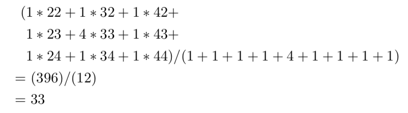
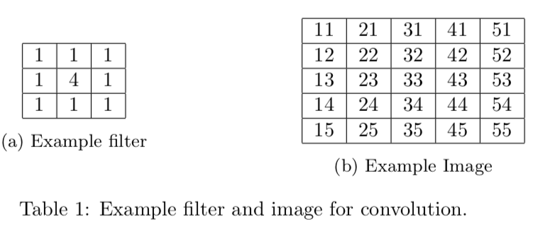

# imageFiltering
## A cpp program that takes in an image and a filter and apply that filter by convolution. 

This is robust, scalable, generalized code that can apply any filter of odd dimesions(3x3,5x5, etc) to any image of odd dimension. For each pixel in the filtered image, the filter is centered at that pixel location, and the pixel values from the original image, for every neighbor that overlaps with the filter, is weighted by the value of the filter at that location. 

The sum of all the values is then normalized by the sum of the weights in the filter. From the example image and filter in Table 1, the value of the center pixel of the filtered image will be:

<br/>




An image is filtered by running the `filter` program from terminal followed by the name of the filter and the name of the image like so:
```
./filter blur2.png robot.jpg
```
